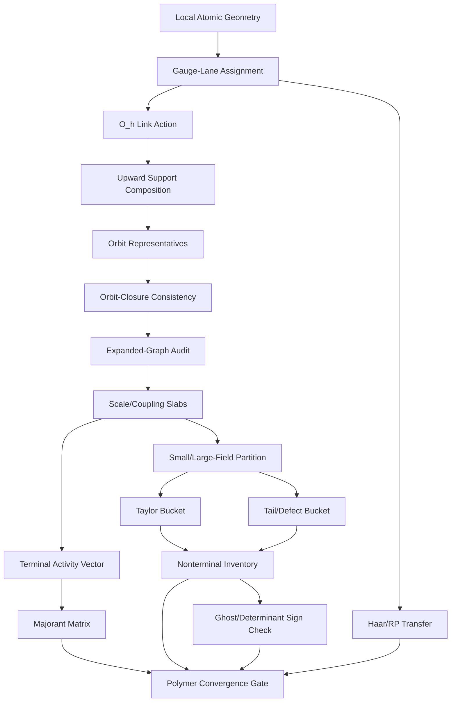

# A Ledger-Gated Constructive RG Program for Three-Dimensional Yang--Mills Theory

**Version:** 1.8  
**Date:** 2026-05-28  
**Author:** Benjamin John Schulz  
**License:** MIT (see `LICENSE`)

## Abstract

This document specifies a ledger-gated constructive renormalization-group (RG) program for three-dimensional Euclidean lattice Yang--Mills theory, initially for compact gauge group \(SU(2)\) with Wilson action. The program is not presented as a completed proof. It is a formal architecture for converting local block-RG calculations into auditable mathematical claims, with exact arithmetic, hard acceptance gates, scale-indexed polymer activity bounds, block-gauge metadata, small/large-field partition ledgers, and periodic thermodynamic-limit compatibility checks. Version 1.7 is the validation-lane and claim-anchoring revision: it preserves the v1.6 implementation-readiness gates and adds an exact two-dimensional SU(N) validation lane, a numerical anchor lane, an observable registry focused on gauge-invariant Wilson-loop and glueball observables, explicit claim-strength annotations in the pipeline DAG, expanded primitive-enclosure backends, and a staged formal finite-group audit lane after Milestone 1A.

The design is motivated by a successful micro-lemma pattern extracted from recent K-star terminal-factor work:

\[
\text{local atoms}
\to
\text{collision graph}
\to
\text{absolute majorant}
\to
\text{cluster/Neumann control}
\to
\text{periodic lift}
\to
\text{KP activity map}
\to
\text{explicit residual budget}.
\]

The central thesis is that this pattern can be transferred to three-dimensional Yang--Mills only after several 3D-specific corrections are made: all activity bounds must be scale/coupling-indexed; all atoms must carry gauge-lane and reflection-positivity metadata; all Taylor terms must carry small/large-field cutoff data; local geometry must be symmetry-reduced before full expansion; block-gauge scale-transition ripples must enter the coupling-flow error budget; and large-field defect suppression must strictly dominate the relevant vector-valued defect entropy rate.

Version 1.2 adds an executable-spine discipline: no additional ledger family is introduced unless it blocks an acceptance gate; terminal K-star closure exports a typed activity vector rather than an RG rung; polymer convergence criteria are modular; fallback-basin certification is separated from UV descent; and comparison lanes for scalar, abelian, stochastic, and Hamiltonian approaches are advisory rather than dependencies.

Version 1.3 is a schema-freeze readiness revision. It repairs the reflection-positivity transfer pipeline, fixes dyadic blocking as the default production scale, restricts tree/block-axial gauge lanes to local UV and intermediate-scale coordinate use, generalizes large-field defects from scalar surface area to vector-valued support measures, makes the lattice-spacing-uniform gap milestone explicitly dependent on Gate S13, and specifies the cubic group implementation by signed permutation matrices with an independent link-coordinate audit.

Version 1.4 adds primitive enclosure certificates, reflection-plane factorization checks, determinant-expansion hooks, boundary-surface multiplier certificates, and mixed-defect junction entropy metadata. Version 1.5 removes the null-field schema risk by requiring discriminated unions keyed by `schema_stage` or `milestone_target`; it also defines composite support action rules, determinant/ghost measure hooks, norm-typed flow errors, and the default order of limits. Version 1.6 adds the last implementation-readiness controls before Milestone 1A: orbit-closure consistency, ghost determinant sign admissibility, a diagrammatic and machine-readable pipeline DAG, and schema-discriminator null tests. Version 1.7 adds validation lanes and claim-anchoring controls: exact two-dimensional SU(N) validation before analytic rows, numerical anchor checks, an observable registry, claim-strength DAG annotations, and an earlier formal finite-group audit lane. Version 1.8 is the open-source/harness revision: it adds a single authoritative gate-dependency graph (`program.yaml`), an explicit program-level kill/pivot budget, physically enforced checker independence, an automated claim ratchet, resource schedules for the combinatorial audits, a pinned exact-arithmetic and determinism policy, and repairs to the discriminated-union schemas (an unreachable `gauge_geometric` branch and schema duplication). These v1.8 additions are documented in Section 18 and shipped as an executable harness in this repository.

---

## 1. Scope and Claim Boundaries

### 1.1 Target model

The initial target is three-dimensional Euclidean lattice Yang--Mills theory on a cubic lattice with compact gauge group \(SU(2)\). The baseline measure is the Wilson lattice measure

\[
Z_\Lambda(\beta)
=
\int \prod_{e\in E(\Lambda)} dU_e
\exp\left(
\frac{\beta}{2}\sum_{p\in P(\Lambda)} \operatorname{Re}\operatorname{Tr} U_p
\right),
\]

where \(dU_e\) is normalized Haar measure on \(SU(2)\), \(U_p\) is the plaquette holonomy, and \(\Lambda\) is a finite periodic cubic box unless otherwise stated.

The physical three-dimensional coupling \(g_3^2\) has mass dimension one. In the Wilson normalization used here, the weak-coupling scaling has the schematic form

\[
\beta(a)\asymp \frac{1}{g_3^2 a}.
\]

Thus, under dyadic coarse-graining \(a_{k+1}=2a_k\), the leading dimensional flow is expected to move \(\beta_k\) toward the strong-coupling/fallback regime.

### 1.2 Near-term theorem target

The near-term target is not the full continuum theorem. The first serious theorem target is a scale-indexed one-step RG rung:

\[
\mathcal N_{\rm KP}^{(k+1)}(S'_{\rm eff})
\le
\Theta_k\,\mathcal N_{\rm KP}^{(k)}(S_{\rm eff})
+E_k,
\qquad
\Theta_k<1,
\]

or a finite-step controlled descent into a certified fallback basin.

### 1.3 Longer-term theorem target

The longer-term target is a volume-uniform and lattice-spacing-uniform clustering estimate for gauge-invariant local observables \(O\):

\[
\left|\langle O(x)O(y)\rangle_c\right|
\le
C_O e^{-m_{\rm phys}|x-y|},
\qquad
m_{\rm phys}\ge c g_3^2,
\qquad
c>0,
\]

with constants that survive the continuum scaling window.

### 1.4 Non-claims

This document does not claim:

1. a completed construction of continuum Yang--Mills theory;
2. a completed proof of a mass gap;
3. a completed Balaban-style RG proof;
4. validity of any uncomputed K-star or nonterminal remainder estimate;
5. use of signed cancellation unless separately certified;
6. reflection-positivity transfer for gauge-fixed or smeared observables unless separately certified.

### 1.5 Anti-bureaucracy rule and minimal executable spine

The ledger machinery is intentionally strict, but it must not become an independent bureaucracy. A new ledger family may be added only if it blocks an acceptance gate, closes a named milestone, or supplies an independent negative control for an already-declared gate.

The first implementation target is the minimal viable ledger spine

\[
\mathrm{MVL}\text{-}1
=
\mathrm{geometry}
+
\mathrm{gauge\ trees}
+
\mathrm{orbit\ representatives}
+
\mathrm{expanded\ graph\ audit}.
\]

The associated row sequence is

```text
YM3D_SCHEMA_DISCRIMINATOR_NULL_TEST_1
YM3D_LOCAL_ATOM_GEOMETRY_1
YM3D_BLOCK_GAUGE_FIXING_LEDGER_1
YM3D_BALABAN_TREE_AXIAL_GAUGE_HOOK_1
YM3D_HAAR_REVERSIBILITY_GAUGE_CHECK_1
YM3D_CUBIC_SYMMETRY_ORBIT_REDUCTION_1
YM3D_ORBIT_CLOSURE_CONSISTENCY_CHECK_1
YM3D_ORBIT_REDUCTION_EXPANDED_GRAPH_AUDIT_1
```

No Taylor, BKAR, defect-tail, continuum-limit, or mass-gap claim is part of MVL-1.

### 1.6 Schema-stage discipline and discriminated unions

Version 1.5 replaces nullable analytic fields with stage-discriminated schema branches. A row must declare either a `schema_stage` or a `milestone_target`, and the JSON Schema must use `oneOf` branches keyed by that discriminator.

The baseline stages are:

```text
combinatorial
gauge_geometric
analytic
rp_transfer
continuum_uniformity
```

A combinatorial Milestone 1A row must not merely set analytic fields to `null`; those fields are forbidden unless a later stage branch explicitly requires them. Conversely, an analytic row that invokes a primitive constant, determinant expansion, cutoff boundary, or RP transfer must populate the corresponding certificate identifiers.

The design therefore separates responsibilities:

| Layer | Responsibility |
|---|---|
| JSON Schema | structural typing, required/forbidden fields, enums, rational interval shape |
| Python generator | canonical row and artifact generation |
| Independent Python checker | mathematical validation: orbits, stabilizers, graph counts, support intersections, interval arithmetic, DAG dependencies |
| Later proof-assistant lane | formalization of stable finite combinatorics after the object model stabilizes |

A typical structural pattern is:

```json
{
  "oneOf": [
    {
      "properties": {"schema_stage": {"const": "combinatorial"}},
      "required": ["schema_stage", "support_id", "anchor_type", "orientation", "orbit_rep_id"],
      "not": {
        "anyOf": [
          {"required": ["primitive_enclosure_ids"]},
          {"required": ["boundary_surface_multiplier_id"]},
          {"required": ["determinant_expansion_id"]}
        ]
      }
    },
    {
      "properties": {"schema_stage": {"const": "analytic"}},
      "required": ["schema_stage", "support_id", "coefficient_bound", "norm_id", "primitive_enclosure_ids"]
    }
  ]
}
```


### 1.7 Schema-discriminator null test

Before the Milestone 1A generator emits any geometric atom, the repository must run a discriminator null-test harness:

```text
YM3D_SCHEMA_DISCRIMINATOR_NULL_TEST_1
validate_schema_discriminators.py
```

The null-test verifies that the `oneOf`/`anyOf` discriminator branches are not merely documentary. At minimum it contains four fixtures:

| Fixture | Expected result |
|---|---|
| valid combinatorial row with only combinatorial fields | pass |
| combinatorial row containing analytic-only fields such as `primitive_enclosure_ids` | fail |
| analytic row missing required analytic certificate fields | fail |
| row with an invalid discriminator value such as `schema_stage = partial` | fail |

A failed null-test blocks Milestone 1A generation. This is a structural test, not a mathematical proof, but it prevents the generator from building expensive data on top of permissive or ambiguous schemas.

### 1.8 Pipeline DAG discipline

The proof pipeline must be represented both in prose and as machine-readable artifacts:

```text
docs/pipeline_dag.mmd
artifacts/pipeline_dag.json
schemas/pipeline_dag.schema.json
```

The conceptual pipeline is:



The machine-readable DAG records node identifiers, artifact types, required parent nodes, allowed schema stages, checker entry points, and claims unlocked by successful validation. A row that is not reachable from the declared DAG is advisory and may not be imported as a proof dependency without a transfer row.

### 1.9 Exact validation and numerical anchor policy

The schema/generator pipeline must be tested on solved or externally constrained cases before analytic three-dimensional rows are allowed to close.

The primary validation lane is

```text
YM2D_SUN_EXACT_VALIDATION_LANE_0
```

This lane is not a prerequisite for the purely combinatorial Milestone 1A generator, because Milestone 1A is three-dimensional geometry and symmetry infrastructure. It is, however, a prerequisite for any analytic row claiming terminal KP smallness, Taylor/tail remainder control, clustering, or fallback-basin certification. The purpose is to run the same ledger machinery on two-dimensional SU(N) Yang--Mills, where exact Wilson-loop and area-law formulas are available for comparison.

A second advisory lane is

```text
YM3D_NUMERICAL_ANCHOR_LANE_0
```

This lane compares generated terminal activity vectors, Taylor coefficients, Wilson-loop estimates, and glueball-correlator proxies against high-precision small-volume or public lattice numerical data. Numerical anchors never close theorem gates by themselves. They produce source-audit warnings when analytic coefficients, normalization conventions, or gauge-ripple budgets disagree with independent numerical evidence.

### 1.10 Observable-driven claim discipline

Every clustering, fallback, or continuum-uniformity claim must specify the gauge-invariant observables to which it applies. The project therefore maintains

```text
YM3D_OBSERVABLE_REGISTRY_1
```

with initial observable classes:

| Observable | Role |
|---|---|
| Wilson loop `W(C)` | area/perimeter-law diagnostics and exact 2D validation |
| scalar glueball operator `O_{0++}` | mass-gap/clustering target |
| connected scalar glueball correlator `G_{0++}(x,y)` | quantitative exponential-clustering target |
| Polyakov loop `P(x)` | finite-temperature diagnostic only, not a zero-temperature mass-gap observable |

Gate S13 must ultimately connect lattice-spacing-uniformity to an observable-specific statement such as

\[
G_{0^{++}}(x,y)
\le
C e^{-m_{\rm phys}|x-y|},
\qquad
m_{\rm phys}\ge c g_3^2,
\qquad c>0,
\]

with constants uniform over the declared scaling window. Until such an observable-specific certificate exists, the project may claim only the weaker lattice or volume-uniform bounds explicitly unlocked by earlier gates.


---

## 2. Lessons Extracted from the K-Star Micro-Lemma Chain

### 2.1 A formula is not a result until it closes a ledger row

The micro-lemma construction became mathematically useful only when local formulas were converted into rows with:

- exact scope;
- parent-row dependencies;
- exact arithmetic;
- machine-checkable acceptance criteria;
- negative controls;
- explicit non-claims;
- and a named next obligation.

For the 3D program, a row is considered closed only if it answers:

\[
\text{What precise theorem fragment is now proved?}
\]

and

\[
\text{What precise theorem fragment remains open?}
\]

### 2.2 Terminal and nonterminal activity must be separated

The K-star terminal factor closed because it was sharply scoped. It was possible to enumerate terminal atoms, form a collision graph, majorize it, lift it to periodic boxes, and place it inside a KP/Balaban activity map. The nonterminal remainder did not close until a source inventory existed.

Therefore the 3D program must maintain two lanes:

\[
\mathcal A_{\rm terminal}^{3D}(k,I_k)
\]

and

\[
\mathcal R_{\rm nonterminal}^{3D}(k,I_k).
\]

Terminal success must never be promoted to full-RG success.

### 2.3 Sign balance is diagnostic, not foundational

A sign-orientation ledger may reveal structure, but no signed cancellation is usable unless a signed analytic covariance or signed mixed-term estimate is separately imported and checked. The default closure route is absolute majorization.

### 2.4 Typed KP activity is preferred over scalar smallness

Scalar KP screens are too crude. The 3D program should use a typed activity vector

\[
\mathbf z(k,I_k)=\left(z_1(k,I_k),\ldots,z_T(k,I_k)\right)
\]

with compatibility matrix \(A_{ts}^{3D}(k)\) and penalties \(a_s(k)\):

\[
\sum_s A_{ts}^{3D}(k)
\Bigl(z_s^{\rm term}(k,I_k)+z_s^{\rm nonterm}(k,I_k)\Bigr)
e^{a_s(k)}
\le a_t(k).
\]

A scalar fallback condition such as

\[
3\bigl(b_{3D}(k,I_k)+R_{3D}(k,I_k)\bigr)<1
\]

may be used only as a conservative diagnostic or early prototype.

### 2.5 A terminal bound should export a residual budget

A terminal graph is useful if it produces not only a pass/fail result but also a residual budget for all remaining activity:

\[
R_{\max}(k,I_k)
\quad\text{or}\quad
\mathbf R_{\max}(k,I_k).
\]

The full nonterminal program is then constrained by this exported budget.

### 2.6 Periodic volume uniformity is a separate theorem fragment

A finite local graph does not automatically imply a thermodynamic bound. Every finite graph row must have a periodic-template successor proving a volume-independent estimate:

\[
\sup_\Lambda\sup_{x\in\Lambda}
\sum_{y\in\Lambda}B_\Lambda(x,y;k,I_k)
\le b_{3D}(k,I_k).
\]

### 2.7 Source-audit failures are useful failures

If a row fails because a required source object does not exist, the architecture is working. In particular, no Taylor remainder bound may be claimed until the nonterminal term inventory exists.

### 2.8 Terminal success exports a vector, not an RG rung

The terminal K-star pattern is a useful micro-lemma template, but it must not be promoted into a full RG theorem. A terminal gate must export a typed activity vector and an absorption contract, not merely a scalar smallness number.

The required terminal output is a typed vector, with components for link, plaquette, face, corner, cube, multiblock, gauge, and tail activity.

The next-scale or full-RG row must prove an absorption statement

\[
\mathbf z_{3D}^{\rm term}(k,I_k)+\mathbf z_{3D}^{\rm nonterm}(k,I_k)
\in
\mathcal D_{\rm conv}(k,I_k),
\]

where the declared convergence domain is KP, Dobrushin, or a tree-graph improved polymer domain.

---

## 3. Scale-Indexed Activity Architecture

### 3.1 Coupling slabs

At each RG scale \(k\), the coupling is represented by an interval slab

\[
I_k=[\beta_k^-,\beta_k^+].
\]

All activity bounds must be uniform over \(\beta\in I_k\).

### 3.2 Terminal activity weight

For a terminal atom class \(\alpha\) of type \(t\), define

\[
z_{t,\alpha}^{\rm term}(k,I_k)
=
 m_\alpha
\sup_{\beta\in I_k}|c_\alpha(\beta,k)|
W_\alpha(k),
\]

where:

- \(m_\alpha\) is the exact orbit/multiplicity factor;
- \(c_\alpha(\beta,k)\) is the coefficient bound;
- \(W_\alpha(k)\) is the polymer weight, including support diameter, representation penalty, scale penalty, and locality penalty.

The full terminal activity type is

\[
z_t^{\rm term}(k,I_k)
=
\sum_{\alpha\in T_t}z_{t,\alpha}^{\rm term}(k,I_k).
\]

### 3.3 Nonterminal activity weight

The nonterminal activity is similarly decomposed:

\[
z_t^{\rm nonterm}(k,I_k)
=
 z_t^{\rm Taylor}
+z_t^{\rm nonlinear}
+z_t^{\rm multiblock}
+z_t^{\rm gauge/RP}
+z_t^{\rm tail}
+z_t^{\rm leakage}.
\]

Every summand must be generated by a source ledger and bounded uniformly over \(I_k\).

### 3.4 Polymer convergence-domain modularity

The activity gate must not be hard-coded to the classical Kotecky--Preiss criterion. The checker schema should allow a declared convergence criterion

```text
criterion ∈ {KP, Dobrushin, Fernandez-Procacci, custom_tree_graph}
```

with an accompanying proof row for the chosen sufficient condition. The default criterion is KP, but the design must allow sharper tree-graph or Penrose-identity bounds when absolute majorization is too crude.

For each criterion, the row must declare:

| Field | Meaning |
|---|---|
| `criterion_id` | KP, Dobrushin, Fernandez--Procacci, or custom |
| `activity_vector_id` | typed vector being tested |
| `compatibility_matrix_id` | graph or matrix used by the criterion |
| `tree_graph_bound_id` | required if using tree-graph improvement |
| `domain_certificate` | exact inequality defining the convergence domain |
| `negative_controls` | known overbudget vectors rejected by the criterion |

The fallback scalar gate remains diagnostic only.

### 3.5 Dimensional-flow monotonicity with gauge-ripple correction

The scale ledger must prove that the RG flow moves toward the fallback basin. If the effective map has the form

\[
\beta_{k+1}=\frac{\beta_k}{L}+\Delta_k,
\]

then the correction term must be decomposed, not treated as a single unstructured error:

\[
|\Delta_k|_{\max}
=
|\Delta_k^{\rm analytic}|_{\max}
+|\Delta_k^{\rm trunc}|_{\max}
+|\Delta_k^{\rm gauge}|_{\max}
+|\Delta_k^{\rm tail}|_{\max}.
\]

Here \( |\Delta_k^{\rm gauge}|_{\max} \) records the analytic effect of changing local block-axial or tree-gauge coordinates between scale \(k\) and scale \(k+1\). Such gauge-ripple terms can cross block boundaries and must be included before a monotone coupling descent is claimed.

The corrected monotonicity gate is

\[
\frac{\beta_k^+}{L}
+|\Delta_k^{\rm analytic}|_{\max}
+|\Delta_k^{\rm trunc}|_{\max}
+|\Delta_k^{\rm gauge}|_{\max}
+|\Delta_k^{\rm tail}|_{\max}
<\beta_k^-.
\]

Equivalently, in interval form,

\[
I_{k+1}^+<I_k^-.
\]

All four components of \(|\Delta_k|_{\max}\) must be computed in the same declared metric space. The scale-coupling ledger must include a `flow_error_norm` object with fields

| Field | Meaning |
|---|---|
| `norm_id` | stable identifier for the norm used by all \(\Delta_k\) components |
| `space` | `effective_coupling_parameter`, `effective_action_density`, `polymer_activity_norm`, or `transfer_operator_norm` |
| `domain` | scale slab and volume class over which the supremum is taken |
| `uniform_over_beta` | whether the estimate is uniform over \(eta\in I_k\) |
| `uniform_over_volume` | whether the estimate is volume independent |
| `unit` | units used for comparison with \(eta\) |
| `conversion_certificate_ids` | certificates converting any component proved in another norm |

If a component is naturally bounded in another norm, the row must include a conversion certificate

\[
\|\Delta\|_{eta}\le C_{
m conv}\|\Delta\|_{\mathcal N}.
\]

No dimensional-flow row may add heterogeneous error components unless all have been converted into the declared `flow_error_norm`.

Any exception must be explicitly declared and bounded. The default production blocking factor is dyadic,

\[
L=2.
\]

If the inequality fails at \(L=2\), the standard remedies are to sharpen field-localization bounds, reduce or rescale the small-field threshold \(p_k\), refine the scale slab \(I_k\), improve the gauge-ripple estimate, or split the block phase cell more finely. Blindly increasing \(L\) is not an accepted default remedy, because the block volume grows as \(L^3\), increasing internal phase space and potentially enlarging \(|\Delta_k^{\rm gauge}|_{\max}\). Larger blocking factors may be explored only in an explicitly marked experimental lane with their own gauge-ripple and boundary-fluctuation budget.

---

## 4. Gauge Handling and Reflection-Positivity Discipline

### 4.1 Gauge lanes

Every local atom, term, or polymer activity must carry a `gauge_lane` field:

| Lane | Meaning |
|---|---|
| `invariant` | Gauge-invariant object, safe for external observables if also RP-compatible |
| `block_axial` | Object expressed in a block axial/tree gauge |
| `tree_gauge` | Object expressed after local spanning-tree gauge fixing |
| `residual` | Object depending on residual boundary gauge variables |
| `gauge_covariant_background` | Object aligned to a covariant background description for IR/fallback use |
| `averaged` | Object transferred back by explicit gauge averaging |
| `internal_only` | Proof-device object not allowed in final OS-facing claims |

A gauge-lane assignment alone is not sufficient. If an object enters a covariant-background lane or any lane with a nontrivial Jacobian, the atom or term must link to a determinant certificate rather than assuming the tree-gauge Haar identity. The base atom schema therefore includes optional hooks `jacobian_type`, `jacobian_determinant_id`, and `ghost_field_dependence`.

### 4.2 Tree-axial gauge metadata

A Balaban-style maximally tree-axial gauge option is included. For each block \(B\), a spanning tree \(T_B\) is declared and links on the tree are fixed:

\[
U_b=\mathbf 1,
\qquad b\in T_B.
\]

The corresponding ledger must verify:

1. \(T_B\) is connected;
2. \(T_B\) contains no cycles;
3. \(T_B\) touches all block vertices;
4. every interior link has bounded distance to the block boundary;
5. residual gauge transformations are represented exactly;
6. the Haar measure change of variables is exactly ledgered.

The lanes `tree_gauge` and `block_axial` are local UV/intermediate-scale coordinate lanes only. They are not permanent infrared descriptions. Repeated block transformations must eventually transfer these objects through a certified gauge-covariant or gauge-invariant lane before fallback-basin or clustering claims are made. The required long-scale transition has the schematic form

```text
tree_gauge or block_axial
  -> gauge_covariant_background
  -> haar_averaged_invariant
  -> polymer_or_character_activity
```

A row that leaves tree/block-axial discontinuities to propagate indefinitely into the infrared fails, because block-boundary coordinate jumps can generate nonlocal artifacts in effective polymer weights.

### 4.3 Haar reversibility

For a gauge-fixing map

\[
U\mapsto (U^{\rm gf},h),
\]

the checker must verify

\[
dU=dU^{\rm gf}\,dh\,J_{\rm gf}.
\]

For compact finite-dimensional lattice tree gauges, the expected Jacobian may be \(J_{\rm gf}=1\), but this must be a proved ledger row. The residual Haar integral must satisfy

\[
\int dh=1
\]

with normalized Haar measure.

### 4.4 Configuration-dependent determinant hooks

Tree and block-axial gauges in finite-dimensional lattice variables may have a constant Haar Jacobian, often certified as

\[
J_{\rm gf}=1.
\]

This simplification is restricted to the declared tree/block-axial lane. If repeated block transformations transfer an object into a gauge-covariant background lane, the row must allow a configuration-dependent Faddeev--Popov or determinant factor. Such a factor is not a static coefficient; it may depend on background and fluctuation variables and may generate nonterminal ghost or determinant-loop terms.

The determinant metadata is represented by optional fields:

| Field | Meaning |
|---|---|
| `jacobian_type` | `constant_haar`, `configuration_dependent_fp`, `ghost_expanded`, or `determinant_ratio` |
| `jacobian_determinant_id` | link to determinant certificate |
| `ghost_field_dependence` | whether ghost variables or ghost loops appear |
| `determinant_expansion_id` | expansion ledger for nontrivial determinant terms |
| `ghost_loop_degree` | loop/degree order if ghost expansion is used |
| `background_field_id` | covariant-background field reference |
| `fp_operator_id` | discrete FP operator or determinant matrix reference |

If `gauge_lane = gauge_covariant_background`, then determinant metadata is mandatory unless a row proves that the determinant contribution cancels or is identically one in the declared finite setting.

A determinant/ghost expansion is not automatically admissible in a positive polymer criterion. Grassmann variables do not define a positive measure in the ordinary bosonic sense, and ghost loops carry signs. Therefore any ghost-expanded determinant contribution must pass

```text
YM3D_GHOST_DETERMINANT_SIGN_CONSISTENCY_CHECK_1
```

before it can enter a convergence gate. The row must distinguish among exact determinant retention, ghost expansion, determinant ratios, and perturbative determinant truncations. If `ghost_field_dependence=true`, the row must specify whether the contribution is handled by a signed/fermionic cluster expansion, by an absolute-majorant certificate, or by an exact determinant-positivity certificate. A ghost-dependent row may not enter an ordinary positive KP activity vector unless `positive_activity_admissible=true` is imported from the determinant sign certificate.

The determinant sign certificate records:

| Field | Meaning |
|---|---|
| `determinant_sign_certificate_id` | sign/positivity or signed-cluster certificate |
| `requires_signed_cluster_certificate` | whether ordinary positive activity criteria are forbidden |
| `positive_activity_admissible` | whether the term may enter a positive polymer bound |
| `absolute_majorant_certificate_id` | certificate replacing signed ghost loops by a positive majorant |
| `determinant_ratio_lower_bound_id` | lower-bound certificate for determinant denominators |
| `ghost_loop_sign_rule` | convention for loop signs and anticommutation ordering |

### 4.5 Gauge-ripple flow correction

Because gauge fixing is performed locally inside coarse blocks, changing the block scale changes the block trees, residual boundary variables, and gauge-averaging maps. The difference between the scale-\(k\) and scale-\(k+1\) gauge coordinates is a proof-device effect, but its analytic size can affect the certified coupling-flow interval.

The ledger `YM3D_GAUGE_RIPPLE_FLOW_CORRECTION_1` records this effect through

\[
|\Delta_k^{\rm gauge}|_{\max}.
\]

Each row must include:

| Field | Meaning |
|---|---|
| `scale_slab_id` | source interval \(I_k\) |
| `block_size_L` | blocking factor |
| `source_tree_id` | scale-\(k\) tree/axial gauge data |
| `target_tree_id` | scale-\(k+1\) tree/axial gauge data |
| `boundary_orbit_id` | residual block-boundary gauge orbit |
| `ripple_support` | support affected by the gauge-coordinate transition |
| `analytic_bound_source` | row proving the ripple estimate |
| `delta_gauge_bound` | certified value of \( |\Delta_k^{\rm gauge}|_{\max} \) |
| `flow_gate_link` | monotonicity row using this term |

No dimensional-flow monotonicity row may pass unless the corresponding gauge-ripple contribution is either zero by exact symmetry or included explicitly in the \(\Delta_k\) budget.

### 4.6 Reflection-positivity discipline

The Wilson lattice measure is the OS-positive object. Gauge-fixed, block-averaged, or internally smeared variables are proof devices unless transferred to gauge-invariant, reflection-compatible objects.

No OS-facing claim may be made from a gauge-fixed row unless the row has passed:

1. gauge averaging;
2. Haar reversibility;
3. reflection-parity tagging;
4. reflection-plane factorization;
5. an explicit `rp_safe_use` check.

The reflection-plane factorization condition is geometric. For each reflection plane \(\Pi\) used in an OS-facing claim, the Haar-averaging support must either be contained in one half-space or be exactly symmetric under reflection:

\[
H_{\rm avg}\subset \Pi^+,
\qquad
H_{\rm avg}\subset \Pi^-,
\qquad
\text{or}
\qquad
\theta(H_{\rm avg})=H_{\rm avg}.
\]

A support that crosses the reflection plane asymmetrically fails Gate S12 unless a separate exact factorization proof is attached. The corresponding certificate records `spatial_factorization_plane`, `support_relation`, and `factorization_certificate_id`.

---

## 5. Small/Large-Field Partition Policy

### 5.1 Default choice: sharp characteristic cutoffs

The first implementation uses sharp cutoffs:

\[
\chi_{\rm SF}(A)+\chi_{\rm LF}(A)=1.
\]

The small-field region may be defined, for example, by

\[
\max_{p\subset B} d(U_p,\mathbf 1)\le p_k,
\]

or by a gauge-fixed block curvature norm

\[
\|F_A\|_{B,k}\le p_k.
\]

### 5.2 Sharp-cutoff rule

No Taylor, BKAR, cluster, or interpolation derivative may hit a sharp cutoff unless a boundary-integration subledger is supplied.

If a derivative hits \(\chi_{\rm SF}\) or \(\chi_{\rm LF}\), the row fails unless the resulting boundary contribution is explicitly integrated and placed in a valid residual bucket.

A valid sharp-boundary row must include a boundary-surface multiplier certificate. The bound has the form

\[
|\mathcal B|
\le
\|f\|_{\infty}
\,M_{\partial{\rm SF}},
\]

where \(M_{\partial{\rm SF}}\) is an exact rational or interval enclosure of the relevant configuration-space hypersurface volume, coarea factor, or trace-theorem constant. The nonterminal row must record `boundary_surface_multiplier_id`, `trace_operator_id`, and `boundary_measure_enclosure_id` whenever a sharp cutoff boundary contributes.

### 5.3 Smooth-cutoff upgrade branch

A later smooth branch may use Gevrey-class partitions

\[
\chi_{\rm core}+\chi_{\rm trans}+\chi_{\rm tail}=1
\]

with derivative bounds

\[
|\partial^m\chi|
\le C_\chi^{m+1}(m!)^\sigma p_k^{-m}.
\]

The derivative leakage gate must then prove that these losses fit inside a declared leakage budget:

\[
R_{\rm leakage}(k,I_k)
\le R_{\rm leakage,max}(k,I_k).
\]

---

## 6. Symmetry-Reduced Local Geometry

### 6.1 Cubic group representation and orbit representatives

The production generator represents the full local cubic group \(O_h\) by signed permutation matrices

\[
M\in \mathrm{Mat}_{3\times 3}(\mathbb Z),
\qquad
M^TM=I,
\qquad
M e_i=\pm e_j.
\]

Unless a row explicitly restricts to the orientation-preserving subgroup, the local symmetry group has

\[
|O_h|=48.
\]

This signed-matrix representation is the source of truth. It induces permutations of oriented links, plaquettes, supports, anchors, and collision pairs. For an oriented link \(\ell=(x,\mu)\) from \(x\) to \(x+e_\mu\), if

\[
M e_\mu=s e_\nu,
\qquad s\in\{+1,-1\},
\]

then for \(s=+1\),

\[
M\cdot(x,\mu)=(Mx,\nu),
\]

while for \(s=-1\), the transformed negative-oriented link is rewritten as a positive-oriented link with an orientation-flip tag:

\[
M\cdot(x,\mu)=(Mx-e_\nu,\nu).
\]

The matrix action on links lifts upward to all composite supports by a mandatory composition rule:

1. apply the signed permutation matrix to every constituent oriented link;
2. canonicalize each transformed link to the positive-axis convention with an orientation-flip tag;
3. sort the transformed links into a canonical integer tuple;
4. compute the transformed support identifier from this tuple;
5. verify that plaquette, cube, and multiblock transforms agree with the transforms of their constituent links.

The orbit schema must record:

| Field | Meaning |
|---|---|
| `group_action_source` | `signed_permutation_matrix` |
| `fundamental_action` | `oriented_link_action` |
| `composition_rule_id` | canonical link-tuple lift rule |
| `support_lift_rule.plaquette` | ordered boundary-link lift |
| `support_lift_rule.cube` | face or boundary-link lift |
| `support_lift_rule.multiblock` | canonical union of block supports |
| `orientation_canonicalization` | positive-axis plus flip tag |
| `canonical_hash_rule` | deterministic lexicographic integer tuple rule |

An independent audit mode reconstructs the same orbit partition by pure link-coordinate transformations and verifies equality with the signed-matrix implementation.

The local cubic symmetry group acts on atoms, supports, anchors, and collision pairs. The program stores orbit representatives \([\alpha]\) with exact stabilizers:

\[
m_{[\alpha]}=\frac{|G_{\rm local}|}{|\operatorname{Stab}(\alpha)|}.
\]

For the default full cubic group, this specializes to

\[
|\operatorname{Orb}(\alpha)|=\frac{48}{|\operatorname{Stab}(\alpha)|}.
\]

Collision edges are likewise represented by orbit pairs

\[
([\alpha],[\beta],\mathrm{collision\_type})
\]

with exact multiplicity.

#### Orbit-closure consistency

The orbit schema must also include an explicit orbit-closure proof. For each representative \([\alpha]\), with canonical representative map \(\operatorname{rep}\), the checker verifies

\[
\forall g\in O_h,\qquad
\operatorname{rep}(g\cdot r_\alpha)=r_\alpha.
\]

Equivalently, for every concrete atom \(\alpha\) and every group element \(g\),

\[
\operatorname{rep}(g\cdot \alpha)=\operatorname{rep}(\alpha)
\]

whenever \(g\cdot\alpha\) lies in the same orbit. The representative map must also be idempotent:

\[
\operatorname{rep}(\operatorname{rep}(\alpha))=
\operatorname{rep}(\alpha).
\]

The checker row

```text
YM3D_ORBIT_CLOSURE_CONSISTENCY_CHECK_1
```

is a hard prerequisite for the expanded-graph audit. It ensures that inconsistent choices of representatives at the link, plaquette, cube, or multiblock level cannot corrupt stabilizer sizes or majorant multiplicities.

### 6.2 Orbit-reduced majorant

The typed majorant matrix is computed from orbit data:

\[
B_{ts}^{3D}(k,I_k)
=
\sum_{[\alpha]\in T_t}
\sum_{[\beta]\in T_s}
 m_{[\alpha],[\beta]}
 w_{[\alpha],[\beta]}(k,I_k).
\]

The full expanded graph is generated only for audit boxes and negative controls.


### 6.3 Expanded-graph audit on small lattices

Orbit reduction is a production representation, not a substitute for validation. The validator must generate fully expanded collision graphs on designated small periodic audit lattices and compare them to the orbit-reduced graph by explicit projection and multiplicity checks.

Let \(G_{\rm exp}=(V_{\rm exp},E_{\rm exp})\) be the fully expanded atom collision graph, and let

\[
\pi:V_{\rm exp}\to V_{\rm orb}
\]

be the projection to orbit representatives. For every orbit-pair collision type \(q\), the checker must verify

\[
M^{\rm expanded}_{[\alpha],[\beta],q}
=
\#\{(u,v)\in E_{\rm exp}:\pi(u)=[\alpha],\pi(v)=[\beta],\ q(u,v)=q\}
=
M^{\rm reduced}_{[\alpha],[\beta],q}.
\]

It must also verify stabilizer multiplicities

\[
m_{[\alpha]}=\frac{|G_{\rm local}|}{|\operatorname{Stab}(\alpha)|}.
\]

This audit is a hard acceptance gate for `YM3D_CUBIC_SYMMETRY_ORBIT_REDUCTION_1`. If the expanded graph and reduced graph disagree on any audit box, the orbit-reduction row fails.

---

## 7. K-Star Terminal Graph Program

### 7.1 Terminal atom export

The first 3D K-star artifact is

`YM3D_KSTAR_TERMINAL_ATOM_EXPORT_1`.

Each atom row must include:

| Field | Meaning |
|---|---|
| `atom_id` | stable unique identifier |
| `orbit_id` | cubic symmetry orbit |
| `support_id` | local support |
| `anchor_type` | link, plaquette, cube, face, edge, corner, multiblock |
| `orientation` | declared orientation convention |
| `representation_label` | spin/character/spin-network label |
| `gauge_lane` | gauge state of the object |
| `rp_parity_tag` | reflection behavior |
| `coefficient_formula` | exact symbolic coefficient |
| `coefficient_bound` | interval/rational upper bound over \(I_k\) |
| `scale_slab` | \(k,I_k\) validity |

### 7.2 Collision graph

The terminal collision graph records geometric overlap, shared boundary variables, shared gauge residues, or support incompatibility. Every edge carries a typed collision label.

### 7.3 Terminal KP gate

The terminal-only gate is

\[
\sum_s A_{ts}^{3D}(k)z_s^{\rm term}(k,I_k)e^{a_s(k)}
\le a_t(k).
\]

Passing this gate exports a residual budget for nonterminal activity. It does not close the full RG rung.

### 7.4 Terminal vector-export contract

A terminal row must export the full vector

\[
\mathbf z_{3D}^{\rm term}(k,I_k)
\]

plus a machine-readable contract describing which nonterminal types may absorb, refine, or interact with each component. The contract must include:

| Field | Meaning |
|---|---|
| `terminal_vector_id` | identifier for the terminal activity vector |
| `component_type` | link, plaquette, face, corner, cube, multiblock, gauge, tail |
| `bound_value` | exact rational/interval bound for that component |
| `scale_slab_id` | scale/coupling interval |
| `absorption_target` | nonterminal bucket or next-scale object that absorbs it |
| `convergence_domain_id` | KP/Dobrushin/Fernandez--Procacci/custom domain |
| `nonclaim` | explicit statement that terminal success is not an RG rung |

A scalar terminal bound may be recorded for readability, but it is not sufficient for a full RG transition.

---

## 8. Nonterminal Taylor and Forest Remainder Program

### 8.1 Required inventory fields

Every nonterminal Taylor or forest-generated term must include:

| Field | Meaning |
|---|---|
| `term_id` | unique term identifier |
| `source_expansion` | Taylor, cumulant, BKAR, character, or other source |
| `forest_id` | forest identifier if BKAR/interpolation is used |
| `support_id` | local support |
| `anchor_type` | support anchor |
| `representation_label` | spin/character/spin-network label |
| `degree` | Taylor or derivative degree |
| `coefficient_formula` | exact symbolic coefficient |
| `interval_upper_bound` | certified upper bound over \(I_k\) |
| `multiplicity` | exact local multiplicity |
| `bucket` | Taylor, nonlinear, multiblock, gauge/RP, tail, leakage |
| `small_field_cutoff_id` | valid Taylor domain |
| `field_norm` | norm used for small-field region |
| `cutoff_threshold` | \(p_k\) or equivalent |
| `boundary_leakage_bound` | if applicable |
| `boundary_surface_multiplier_id` | boundary/trace certificate if a sharp cutoff boundary is used |
| `primitive_enclosure_ids` | analytic primitive intervals imported by the term |
| `jacobian_determinant_id` | determinant/FP certificate if the term contains nontrivial Jacobian data |
| `determinant_expansion_id` | expansion ledger for configuration-dependent determinants |
| `ghost_field_dependence` | whether the term depends on ghost variables |
| `ghost_loop_degree` | degree/order of ghost loop if applicable |
| `ghost_measure_id` | Berezin/ghost integration measure certificate if ghost fields appear |
| `ghost_cutoff_policy` | `none`, `inherited_from_gauge`, or `separate_grassmann` |
| `grassmann_cutoff_id` | optional algebraic/Grassmann cutoff or truncation certificate |
| `tail_bucket_link` | complement/tail assignment |
| `parent_rows` | required source rows |

Configuration-dependent determinant terms must never be compressed into an untyped coefficient. If `determinant_expansion_id` is present, the row must also specify the determinant source, background-field dependence, fluctuation-field dependence, and the certificate proving the interval enclosure for each determinant-generated primitive.

If `ghost_field_dependence=true`, the row must provide a `ghost_measure_id`. Grassmann variables are not ordinary bosonic amplitude variables; therefore the design uses the neutral field `ghost_measure_id` and an explicit `ghost_cutoff_policy` rather than assuming that ghost fields inherit the gauge-field small/large-field partition. A separate `grassmann_cutoff_id` is required only if a later analytic lane introduces an algebraic ghost truncation or cutoff boundary.

### 8.2 BKAR/forest declaration

If BKAR or another forest formula is used, the inventory must declare:

- forest edge set;
- interpolation parameters;
- differentiated factors;
- induced support;
- connectivity class;
- symmetry factor;
- derivative order;
- cutoff-interaction status.

The multiblock combinatorics must match the typed compatibility matrix.

---

## 9. Large-Field and Defect-Tail Ledger

The large-field complement is represented as thermodynamic defects. The ledger must not assume that all non-abelian defects are closed dual surfaces measured only by area. The schema supports a vector-valued support measure

\[
\mathbf m(D)=(A(D),\ell(D),V(D),n_\partial(D),J(D),B(D),E(D),\ldots),
\]

where \(A\) is surface area, \(\ell\) is line length or tube length, \(V\) is localized block volume, \(n_\partial\) records boundary-pinned contributions, \(J\) records junctions, \(B\) records branching nodes, and \(E\) records endpoints or attachment points when relevant. This allows the tail ledger to represent co-dimension-one center-vortex-like sheets, line-like tubes, localized high-curvature lumps, boundary-pinned defects, and mixed complexes in which lower-dimensional and higher-dimensional supports intersect.

Each defect row includes:

| Field | Meaning |
|---|---|
| `defect_id` | unique defect identifier |
| `support` | support set |
| `scale` | RG scale \(k\) |
| `scale_slab_id` | coupling interval \(I_k\) |
| `defect_type` | surface, tube, localized_high_curvature, boundary_pinned, mixed, gauge, tail |
| `support_codimension` | declared codimension or mixed-complex label |
| `support_measure_vector` | vector \(\mathbf m=(A,\ell,V,n_\partial,J,B,E,\ldots)\) |
| `area_component` | surface/plaquette area, if applicable |
| `length_component` | line/tube length, if applicable |
| `volume_component` | localized block volume, if applicable |
| `junction_count` | number of topology-changing junctions |
| `branching_node_count` | number of branching nodes in mixed complexes |
| `endpoint_count` | number of endpoints or boundary attachments |
| `topological_modifier_rate` | entropy-rate component assigned to junction/branching data |
| `defect_topology_type` | closed surface, vortex sheet, tube, lump, boundary-pinned defect, or mixed complex |
| `action_cost_vector` | coefficient vector for scale-slab action suppression |
| `entropy_model_id` | source row for the entropy bound |
| `entropy_rate_vector` | entropy-rate vector for the declared support measure |
| `entropy_prefactor` | prefactor \(C_{\rm ent}\) |
| `dominance_margin` | certified lower bound for action-cost minus entropy-rate against the support measure |
| `tail_sum_bound` | resulting geometric/exponential sum |
| `suppression_factor` | exponential or character-tail suppression |
| `interaction_range` | compatibility range |
| `kp_type` | typed activity class |

The tail gate checks estimates of the form

\[
\sum_{D\ni x} M(D)
\exp\left[-\mathbf c_{\rm tail}(k,I_k)\cdot \mathbf m(D)\right]
\le R_{\rm tail}(k,I_k).
\]

### 9.1 Defect entropy dominance

For each declared defect class, the ledger must provide an entropy estimate

\[
N(\mathbf m)\le C_{\rm ent}
\exp\left(\boldsymbol\mu_{\rm ent}\cdot \mathbf m\right).
\]

The large-field tail row may pass only if action cost strictly dominates entropy over the full scale slab. In vector form, the required condition is

\[
\left(\mathbf c_{\rm tail}(k,I_k)-\boldsymbol\mu_{\rm ent}\right)\cdot\mathbf m
\ge
\delta_{\rm tail}\|\mathbf m\|
\]

for all admissible support-measure vectors \(\mathbf m\), with \(\delta_{\rm tail}>0\) recorded. For a pure surface-defect specialization, this reduces to

\[
c_{\rm tail}(k,I_k)-\mu_{\rm ent}\ge\delta_{\rm tail}>0.
\]

This generalization is required because the Göpfert--Mack compact \(U(1)\) surface-defect template is only a structural guide. The non-abelian \(SU(2)\) ledger must also audit lower-dimensional or localized high-curvature defect supports.

Required artifact:

```text
YM3D_DEFECT_SUPPORT_MEASURE_LEDGER_1
```

and dominance checker:

```text
YM3D_DEFECT_ENTROPY_DOMINANCE_CHECK_1
```

---

## 10. Fallback Basin Certification

The UV ladder does not by itself prove infrared clustering. A separate row must certify entry into a fallback basin where a strong-coupling, character-expansion, defect-expansion, transfer-matrix, or terminal polymer argument supplies volume-uniform decay.

The required artifact is

```text
YM3D_FALLBACK_BASIN_CERTIFICATION_1
```

It must not be replaced by the weaker handoff row. The handoff row records that the UV flow has reached the relevant scale; the certification row proves that the terminal-scale theory lies inside a convergence region with explicit constants.

A valid certification row must include:

| Field | Meaning |
|---|---|
| `fallback_method` | character expansion, defect expansion, polymer expansion, transfer matrix, or hybrid |
| `terminal_scale_id` | scale \(k^\ast\) entering the fallback analysis |
| `input_activity_vector` | vector imported from the UV ladder |
| `convergence_criterion` | KP, Dobrushin, Fernandez--Procacci, or other certified criterion |
| `mass_scale_bound` | decay scale or spectral-gap lower bound at the terminal scale |
| `volume_uniformity_row` | proof that constants are independent of periodic volume |
| `overlap_or_majorization_check` | comparison between UV terminal action and fallback representation |
| `nonclaims` | no continuum claim unless \(a\)-uniformity is separately proved |

The fallback certification gate is

\[
\mathbf z_{3D}^{\rm terminal}(k^\ast,I_{k^\ast})
\in
\mathcal D_{\rm fallback}
\]

with the fallback convergence domain explicitly defined by the chosen convergence criterion.

---

## 11. Mandatory Sanity Gates

### Gate S1: cutoff leakage

For smooth cutoffs, every derivative contribution must be bounded:

\[
C_{\rm deriv}(k,m)p_k^{-m}z_{\rm local}(k,I_k)
\le R_{\rm leakage}(k,I_k).
\]

For sharp cutoffs, no derivative may hit a cutoff unless an explicit boundary-integration row exists. Any such row must include `boundary_surface_multiplier_id` and an independently checkable trace/surface-volume certificate.

### Gate S2: Haar reversibility

Every transition from gauge-fixed to invariant lane must prove

\[
dU=dU^{\rm gf}\,dh\,J_{\rm gf},
\qquad
\int dh=1.
\]

### Gate S3: typed compatibility sparsity

If two support types cannot geometrically intersect under the declared block geometry, then

\[
A_{ts}^{3D}=0.
\]

A nonzero entry in such a slot fails the row.

### Gate S4: dimensional-flow monotonicity with gauge-ripple budget

Every scale transition must verify

\[
\frac{\beta_k^+}{L}
+|\Delta_k^{\rm analytic}|_{\max}
+|\Delta_k^{\rm trunc}|_{\max}
+|\Delta_k^{\rm gauge}|_{\max}
+|\Delta_k^{\rm tail}|_{\max}
<\beta_k^-.
\]

The gauge-ripple contribution must be zero by proof or explicitly bounded. All components in this inequality must be expressed in the same declared `flow_error_norm`; heterogeneous bounds require conversion certificates before summation.

### Gate S5: orbit-reduction expanded-graph audit

Orbit-reduced counts must agree with fully expanded counts on designated small audit boxes by explicit projection/isomorphism and multiplicity checks.

### Gate S5a: orbit-closure consistency

For every stored orbit representative and every declared element of \(O_h\), the transformed atom must map back to the same representative under the canonical representative map. The checker must verify representative idempotence, group-action closure on the valid atom universe, and agreement of orbit sizes with stabilizer sizes. This gate closes before the expanded-graph audit.

### Gate S6: periodic volume uniformity

Every thermodynamic claim must prove constants independent of periodic volume.

### Gate S7: terminal/nonterminal separation

Terminal-only rows may not claim full RG smallness.

### Gate S8: exact arithmetic

All smallness margins must be stored in exact rational or interval form. Decimal values are display-only.

### Gate S8b: primitive enclosure certificates

Any analytic row using a non-rational primitive constant must link to a `primitive_enclosure_certificate`. This includes Bessel/character coefficients, lattice Green's functions, heat-kernel coefficients, spectral constants, quadrature values, and recurrence-generated constants. The certificate must state the mathematical origin of the primitive, the rational input interval, the rational output enclosure, the certification method, and a truncation or remainder bound that an independent checker can verify using rational arithmetic.

### Gate S9: vector-valued defect entropy dominance

The large-field defect-tail ledger must prove

\[
\left(\mathbf c_{\rm tail}(k,I_k)-\boldsymbol\mu_{\rm ent}\right)\cdot\mathbf m
\ge\delta_{\rm tail}\|\mathbf m\|
\]

for every admissible support-measure vector \(\mathbf m\) and every relevant scale/coupling interval, with the resulting exponential defect sum included in \(R_{\rm tail}(k,I_k)\). The scalar surface-area test is only a specialization.

### Gate S10: convergence-criterion declaration

Every polymer/activity gate must declare its convergence criterion. If the row uses a tree-graph improvement rather than classical KP, it must import the relevant tree-graph or Penrose-identity bound and provide negative controls showing that overbudget vectors are rejected.

### Gate S10b: ghost determinant sign consistency

A determinant-generated or ghost-expanded term may not enter an ordinary positive polymer activity bound unless a determinant sign or absolute-majorant certificate proves that this use is admissible. If the term is handled by a signed/fermionic cluster expansion, the row must declare the signed convergence criterion separately and must not be counted as a positive KP activity without transfer.

### Gate S11: fallback-basin certification

The UV ladder may not claim infrared clustering until `YM3D_FALLBACK_BASIN_CERTIFICATION_1` proves that the terminal-scale effective theory lies in a certified strong-coupling, character-expansion, defect-expansion, transfer-matrix, or polymer convergence domain.

### Gate S12: reflection-positivity transfer after gauge averaging

If a row enters an OS-facing claim, the checker must verify the machine-parseable transition pipeline

```text
gauge_fixed_object
  -> haar_averaged_invariant_object
  -> reflection_tagged_object
  -> os_admissible_object
```

Equivalently, the mathematical transition is

\[
\text{gauge-fixed object}
\to
\text{Haar-averaged invariant object}
\to
\text{reflection-parity-tagged object}
\to
\text{OS-admissible observable}.
\]

Gauge-lane metadata and Haar reversibility are necessary but not sufficient; the final object must also carry an `rp_safe_use=true` tag imported from a parity/reflection ledger. In addition, the Haar-averaging support must pass the reflection-plane factorization test: it must lie strictly in one half-space relative to the declared reflection plane, or be exactly reflection-symmetric with a certified pairing of integrated gauge variables. An asymmetric crossing of the reflection plane fails Gate S12.

### Gate S13: continuum-uniformity placeholder

No row may promote volume-uniform lattice clustering to a continuum mass-gap statement unless an implemented \(a\)-uniformity ledger proves that the physical mass lower bound remains positive as \(a\to 0\). This gate is a placeholder in the present design, but it is a hard dependency for any lattice-spacing-uniform physical gap claim.

---

## 12. Operational Milestones

### Milestone 0: Exact two-dimensional SU(N) validation lane

Milestone 0 is achieved when `YM2D_SUN_EXACT_VALIDATION_LANE_0` runs the ledger pipeline on a two-dimensional SU(N) benchmark and compares its observable output against exact Wilson-loop/area-law formulas.

Milestone 0 is not required before the three-dimensional combinatorial Milestone 1A generator. It is required before analytic three-dimensional rows close.

Allowed claim:

\[
\text{The ledger pipeline reproduces the declared exact 2D benchmark observables.}
\]

Not allowed:

\[
\text{3D analytic smallness, RG contraction, or mass-gap claims.}
\]

### Milestone 1: Pure combinatorial closure

Closed rows:

- `YM3D_LOCAL_ATOM_GEOMETRY_1`
- `YM3D_BLOCK_GAUGE_FIXING_LEDGER_1`
- `YM3D_BALABAN_TREE_AXIAL_GAUGE_HOOK_1`
- `YM3D_HAAR_REVERSIBILITY_GAUGE_CHECK_1`
- `YM3D_CUBIC_SYMMETRY_ORBIT_REDUCTION_1`
- `YM3D_ORBIT_REDUCTION_EXPANDED_GRAPH_AUDIT_1`

Meaning: the local geometry, gauge trees, residual gauge metadata, orbit representatives, support types, stabilizer multipliers, and reduced-vs-expanded collision graph multiplicities are verified. No analytic smallness has been proved.

### Milestone 1A: Single-block executable audit

This is the first executable checkpoint after pure design. On one or more small periodic audit boxes, the generator must produce both:

1. the fully expanded atom/collision graph; and
2. the orbit-reduced graph with stabilizer and multiplicity data.

The independent checker must verify the exact projection identity

\[
M^{\rm expanded}_{[\alpha],[\beta],q}
=
M^{\rm reduced}_{[\alpha],[\beta],q}
\]

for every orbit-pair collision type \(q\).

Milestone 1A is the first target for automated testing. It is deliberately decoupled from analytic smallness.

### Milestone 2: Single-scale UV bound

For the first weak-coupling slab \(I_0\), the full scale-indexed activity gate passes:

\[
\sum_s A_{ts}^{3D}(0)
\left(z_s^{\rm term}(0,I_0)+z_s^{\rm nonterm}(0,I_0)\right)e^{a_s(0)}
\le a_t(0).
\]

Meaning: one UV scale has local KP stability.

### Milestone 3: Multi-scale UV ladder

A sequence

\[
I_0\to I_1\to\cdots\to I_K
\]

passes both dimensional-flow monotonicity and the full activity gate at each scale.

### Milestone 4: Fallback basin certification

The ladder reaches a threshold \(k^\ast\) where

\[
g_3^2 a_{k^\ast}\asymp 1
\]

or \(I_{k^\ast}\) lies in a certified fallback interval. The proof then transitions from the UV Taylor/small-field map to a strong-coupling, character-expansion, defect-expansion, transfer-matrix, or terminal polymer map, and `YM3D_FALLBACK_BASIN_CERTIFICATION_1` proves that the terminal-scale effective theory lies inside the declared convergence domain.

### Milestone 5: Volume-uniform clustering

The cluster/polymer expansion proves

\[
|\langle O(x)O(y)\rangle_c|
\le C_O(k)e^{-m_k d(x,y)}
\]

with constants independent of finite periodic volume.

### Milestone 6: Lattice-spacing-uniform physical gap window

This milestone is closed only after Gate S13 is implemented and passed. The required result is that the clustering scale yields

\[
m_{\rm phys}\ge c g_3^2,
\qquad c>0,
\]

uniformly in the continuum scaling window. Before Gate S13 closes, the strongest allowed claim is volume-uniform lattice clustering inside certified slabs, not a continuum-stable physical mass lower bound. Milestone 6 uses the default sequential limit order: first \(\Lambda	o\infty\) at fixed \(a\), then \(a	o0\) under Gate S13 uniformity.

---

## 13. Artifact Sequence

The recommended first sequence is:

0. `YM3D_SCHEMA_STAGE_DISCRIMINATOR_1`
0a. `YM3D_SCHEMA_DISCRIMINATOR_NULL_TEST_1`
0b. `YM3D_PIPELINE_DAG_DECLARATION_1`
1. `YM3D_LOCAL_ATOM_GEOMETRY_1`
2. `YM3D_BLOCK_GAUGE_FIXING_LEDGER_1`
3. `YM3D_BALABAN_TREE_AXIAL_GAUGE_HOOK_1`
4. `YM3D_HAAR_REVERSIBILITY_GAUGE_CHECK_1`
5. `YM3D_CUBIC_SYMMETRY_ORBIT_REDUCTION_1`
5a. `YM3D_ORBIT_CLOSURE_CONSISTENCY_CHECK_1`
6. `YM3D_ORBIT_REDUCTION_EXPANDED_GRAPH_AUDIT_1`
7. `YM3D_SCALE_COUPLING_SLAB_LEDGER_1`
7a. `YM3D_FLOW_ERROR_NORM_LEDGER_1`
8. `YM3D_SMALL_LARGE_FIELD_PARTITION_LEDGER_1`
9. `YM3D_CUTOFF_LEAKAGE_CHECK_1`
10. `YM3D_KSTAR_TERMINAL_ATOM_EXPORT_1`
11. `YM3D_KSTAR_TERMINAL_COLLISION_GRAPH_1`
12. `YM3D_KP_SPARSITY_GEOMETRY_CHECK_1`
13. `YM3D_TERMINAL_KP_ACTIVITY_MAP_SCALE_INDEXED_1`
14. `YM3D_NONTERMINAL_TAYLOR_TERM_INVENTORY_1`
15. `YM3D_FP_DETERMINANT_EXPANSION_LEDGER_1`
15a. `YM3D_GHOST_DETERMINANT_SIGN_CONSISTENCY_CHECK_1`
16. `YM3D_BOUNDARY_SURFACE_MULTIPLIER_LEDGER_1`
17. `YM3D_PRIMITIVE_ENCLOSURE_CERTIFICATE_LEDGER_1`
18. `YM3D_RP_SPATIAL_FACTORIZATION_CHECK_1`
19. `YM3D_GAUGE_RIPPLE_FLOW_CORRECTION_1`
20. `YM3D_THERMODYNAMIC_DEFECT_TAIL_LEDGER_1`
21. `YM3D_DEFECT_SUPPORT_MEASURE_LEDGER_1`
22. `YM3D_DEFECT_ENTROPY_DOMINANCE_CHECK_1`
23. `YM3D_BKAR_FOREST_REMAINDER_LEDGER_1` if forest interpolation is used
24. `YM3D_ONE_STEP_RG_RUNG_SCALE_INDEXED_1`
25. `YM3D_FALLBACK_BASIN_HANDOFF_1`
26. `YM3D_FALLBACK_BASIN_CERTIFICATION_1`
27. `YM3D_VOLUME_UNIFORM_CLUSTERING_1`
28. `YM3D_A_UNIFORM_GAP_WINDOW_1`
Validation and advisory lanes are maintained outside the critical three-dimensional proof DAG unless a formal transfer row is added:

- `YM2D_SUN_EXACT_VALIDATION_LANE_0` -- mandatory before analytic three-dimensional rows close;
- `YM3D_NUMERICAL_ANCHOR_LANE_0` -- advisory numerical/source-audit lane;
- `YM3D_OBSERVABLE_REGISTRY_1` -- mandatory registry for observable-specific claims;
- `YM3D_PHI4_BENCHMARK_LANE_0` -- advisory scalar benchmark;
- `YM3D_U1_BENCHMARK_LANE_0` -- advisory compact abelian benchmark;
- `YM3D_SPDE_COMPARISON_LANE_0` -- advisory stochastic-quantization comparison lane;
- `YM3D_HAMILTONIAN_COMPARISON_LANE_0` -- advisory Hamiltonian/orbit-space comparison lane;
- `YM3D_FORMAL_FINITE_GROUP_AUDIT_LANE_1` -- formalization lane for stable finite group-action/orbit invariants after Milestone 1A.

---

## 14. Checker Requirements

Every checker must include positive and negative controls. The design distinguishes hard mathematical negative controls from routine schema-hygiene checks. The document foregrounds hard controls; duplicated identifiers, missing parent IDs, malformed references, and similar hygiene failures belong in CI/checker documentation.

Hard negative controls include:

- illegal signed cancellation;
- finite-volume claim promoted to thermodynamic or continuum claim;
- terminal-only row promoted to full-RG row;
- gauge-fixed row used in invariant claim without Haar transfer;
- asymmetric Haar/RP support crossing a reflection plane;
- smooth cutoff derivative leakage omitted;
- sharp cutoff differentiated without a boundary-surface multiplier ledger;
- nonzero compatibility entry where geometry requires zero;
- nonmonotone \(\beta_k\) flow accepted;
- heterogeneous \(\Delta_k\) norms summed without conversion certificates;
- gauge-ripple correction omitted from the flow-error budget;
- vector-valued defect entropy rate not dominated by the tail action-cost vector;
- scalar surface-area defect model used for a lower-dimensional, junctioned, or localized high-curvature defect;
- missing junction/branching entropy component for a mixed defect complex;
- orbit-reduction multipliers not verified against expanded audit graphs;
- orbit representative fails closure under an element of `O_h`;
- representative map is not idempotent;
- composite support orbit action does not match the lift from transformed constituent links;
- bounded-field approximation reported as full large-field control;
- fallback-basin handoff reported as fallback-basin certification;
- terminal scalar bound used without typed vector export;
- polymer criterion changed without updating the convergence-domain certificate;
- ghost-dependent determinant term missing a ghost-measure certificate;
- ghost-expanded determinant term entering a positive polymer bound without sign/absolute-majorant admissibility;
- configuration-dependent determinant compressed into an untyped static coefficient;
- primitive enclosure interval accepted without an independently checkable remainder certificate;
- primitive enclosure backend accepted without version, precision, directed-rounding, or rationalized output metadata;
- comparison-lane or numerical-anchor result imported as a proof dependency without a formal transfer row;
- tree/block-axial gauge lane propagated into fallback or clustering claims without gauge-covariant or invariant transfer;
- Milestone 6 claimed before Gate S13 is implemented and closed;
- analytic fields accepted as nullable in a combinatorial schema branch rather than forbidden by a stage discriminator;
- pipeline DAG dependency missing or inconsistent with row parent IDs;
- discriminator null-test fixtures do not produce the expected pass/fail pattern;
- observable-specific clustering claim made without an observable-registry entry;
- claim-strength upgrade made without passing the corresponding DAG node and checker;
- analytic three-dimensional row closed before the exact two-dimensional validation lane has passed or an explicit waiver has been recorded.

---

## 15. Automation and Formalization Strategy

The first implementation should prioritize executable correctness over full proof-assistant formalization. The first executable target is not atom generation; it is the discriminator null-test harness:

```text
validate_schema_discriminators.py
```

Only after this harness passes should `YM3D_LOCAL_ATOM_GEOMETRY_1` emit concrete atoms.

The staged stack is:

1. Python exact-arithmetic generator for finite geometry, group actions, orbit representatives, and expanded audit graphs.
2. JSON Schema or equivalent machine-readable schemas for all row types.
3. Independent checker scripts that do not share internal generator code.
4. Property-based negative controls for orbit counts, gauge-lane misuse, illegal support intersections, and missing stabilizers.
5. Lean 4 or another proof assistant for the finite group-action/orbit/stabilizer invariants immediately after Milestone 1A stabilizes the object vocabulary. This formal lane should cover `O_h` action closure, representative idempotence, stabilizer/orbit identities, and canonical lift consistency.

The repository should treat generated ledgers as artifacts and checkers as independent validators. A generator success is not a proof; only an independent checker pass closes a row.

The schema layer must use discriminated unions keyed by `schema_stage` or `milestone_target`; milestone-specific enforcement is not deferred to Python alone. The Python checker verifies semantic mathematics, but the JSON Schema must reject structurally invalid rows immediately.

Recommended schema families:

| Schema | Purpose |
|---|---|
| `stage_discriminated_row.schema.json` | common `oneOf` discriminator pattern for combinatorial, gauge-geometric, analytic, RP-transfer, and continuum-uniformity rows |
| `pipeline_dag.schema.json` | machine-readable proof/data-flow DAG with node dependencies and claims unlocked |
| `convergence_criterion.schema.json` | KP, Dobrushin, tree-graph, signed/fermionic, and determinant-admissibility convergence modes |
| `atom.schema.json` | local atom/support/gauge metadata |
| `orbit.schema.json` | cubic orbit representatives, stabilizers, and upward composition rules from links to plaquettes/cubes/multiblocks |
| `collision.schema.json` | expanded and reduced collision edges |
| `nonterminal_term.schema.json` | Taylor, forest, determinant, ghost-measure, cutoff, and primitive-certificate fields for analytic terms |
| `activity_vector.schema.json` | typed terminal/nonterminal activity vectors |
| `convergence_criterion.schema.json` | KP/Dobrushin/tree-graph domain certificates |
| `defect_support.schema.json` | vector-valued support measures, junction/branching data, and entropy dominance data |
| `defect_entropy_certificate.schema.json` | action-cost/entropy dominance certificates for mixed defects |
| `fp_determinant_certificate.schema.json` | configuration-dependent FP or determinant-expansion certificates |
| `rp_transfer.schema.json` | reflection-plane factorization and OS-transfer certificates |
| `boundary_surface_certificate.schema.json` | sharp-cutoff boundary surface/trace multiplier certificates |
| `primitive_enclosure_certificate.schema.json` | rationally checkable enclosures for non-rational analytic constants |
| `scale_coupling_slab.schema.json` | scale slabs, common flow-error norm, converted \(\Delta_k\) components, and monotonicity claims |
| `continuum_limit_policy.schema.json` | thermodynamic/continuum limit-order policy and Gate S13 dependencies |
| `milestone.schema.json` | closed rows and non-claims per milestone |

Base geometry rows do not carry nullable analytic certificate fields. Instead, their discriminated schema branch forbids analytic-only fields. Later analytic branches require the relevant certificate IDs. This preserves Milestone 1A as a combinatorial task while preventing both breaking schema changes and accidental acceptance of incomplete analytic rows.

Rapid prototyping may use a separate `schema_profile: "experimental"` branch, but experimental artifacts cannot close gates. Gate-closing artifacts must use `schema_profile: "strict"` and the stage-discriminated production schemas.

---

## 16. Validation, Benchmark, Numerical, and Comparison Lanes

The main proof DAG remains the lattice constructive RG path. Validation and comparison lanes do not close proof gates unless a formal transfer row is added. They are nevertheless required to prevent the schema/checker machinery from drifting away from known mathematics and external data.

### 16.1 Exact two-dimensional SU(N) validation lane

`YM2D_SUN_EXACT_VALIDATION_LANE_0` is the strongest validation lane. It runs the combinatorial, orbit-reduction, observable, and Wilson-loop portions of the ledger pipeline on two-dimensional SU(N) Yang--Mills and compares output against exact Wilson-loop/area-law formulas.

This lane is not a prerequisite for Milestone 1A, but it blocks analytic three-dimensional rows unless an explicit waiver is recorded. The lane is intended to catch errors in link-to-plaquette lifting, orbit multipliers, gauge-lane transfers, reflection-factorization metadata, and observable normalization before the three-dimensional Taylor/defect/BKAR rows are attempted.

### 16.2 Numerical anchor lane

`YM3D_NUMERICAL_ANCHOR_LANE_0` compares generator outputs against small-volume exact enumeration where possible and against external Monte Carlo or high-precision lattice data where appropriate. Numerical anchors may compare:

- terminal activity vector components;
- small-field Taylor coefficients;
- Wilson-loop estimates;
- scalar glueball correlator proxies;
- string-tension or glueball-mass ratios used only as external sanity checks.

Numerical anchors never prove a theorem. They emit source-audit warnings when analytic normalizations, coefficient bounds, or gauge-ripple estimates disagree with independent numerical evidence.

### 16.3 Observable registry

`YM3D_OBSERVABLE_REGISTRY_1` is mandatory for any claim beyond pure combinatorics. Each analytic, clustering, fallback, or continuum-uniformity row must declare which registered gauge-invariant observables it controls.

The initial registry contains Wilson loops, scalar glueball operators, connected scalar glueball correlators, and Polyakov-loop diagnostics. Polyakov loops are finite-temperature diagnostics and do not by themselves constitute a zero-temperature mass-gap claim.

### 16.4 Scalar benchmark lane

`YM3D_PHI4_BENCHMARK_LANE_0` tests polymer/KP, cutoff leakage, forest formulas, and periodic lifts without gauge-lane complexity. It should not delay Milestone 1 for Yang--Mills.

### 16.5 Abelian compact gauge benchmark lane

`YM3D_U1_BENCHMARK_LANE_0` tests compact gauge variables, defect tails, and entropy suppression against known three-dimensional compact abelian confinement structures. It is a benchmark for tail accounting, not a substitute for non-Abelian control.

### 16.6 Stochastic quantization comparison lane

`YM3D_SPDE_COMPARISON_LANE_0` tracks continuum stochastic-quantization work as a comparison route. It may inform lattice-to-continuum observables, gauge-covariant state spaces, renormalization metadata, or quotient-space design, but it is not a dependency of the lattice proof DAG.

### 16.7 Hamiltonian/orbit-space comparison lane

`YM3D_HAMILTONIAN_COMPARISON_LANE_0` tracks Karabali--Kim--Nair-type Hamiltonian/orbit-space approaches in \(2+1\) dimensions. This lane may suggest relevant operators or mass scales, but it does not replace Euclidean lattice RG certification.

### 16.8 Formal finite-group audit lane

`YM3D_FORMAL_FINITE_GROUP_AUDIT_LANE_1` begins after Milestone 1A stabilizes the finite object vocabulary. It should formalize the cubic group action, orbit-closure theorem, stabilizer/orbit identity, canonical representative idempotence, and upward composition of link actions to composite supports. The initial production generator remains Python exact-arithmetic; the formal lane prevents finite-combinatorial drift after the objects are known.

---

## 17. Literature Anchors

The design uses the following established methods as anchors or cautionary templates.

### Balaban ultraviolet stability

Balaban proved ultraviolet stability for three-dimensional Wilson lattice pure Yang--Mills theories using a renormalization-group method for lattice gauge theories. This is the closest methodological anchor for the present program.

### Tree-axial gauge methods

Balaban-style block gauge fixing motivates the explicit tree-axial gauge ledger. The program must treat gauge fixing, residual gauge variables, and Haar reversibility as first-class proof objects.

### Göpfert--Mack three-dimensional U(1) confinement

Göpfert and Mack proved confinement of static quarks in three-dimensional compact \(U(1)\) lattice gauge theory for all couplings. This is not a direct non-Abelian \(SU(2)\) substitute. It is used here as a structural guide for thermodynamic defect-tail accounting.

### Dimock/Balaban RG expositions and bounded-field approximations

Dimock's expositions and applications of Balaban-style RG methods clarify the role of bounded-field approximations and the danger of confusing a bounded-field result with full large-field control.

### BKAR/forest formulas

If nonterminal remainders are organized by forest interpolation, the Brydges--Kennedy--Abdesselam--Rivasseau family of forest formulas must be declared explicitly. The formula determines multiblock combinatorics and compatibility types.

### Abstract polymer convergence improvements

Classical KP is the default starting point, but improved abstract polymer criteria, including Dobrushin-type and Fernandez--Procacci/tree-graph bounds, should be available as alternative convergence domains when absolute KP majorization is too crude.

### Stochastic quantization and SPDE comparison

Recent stochastic-quantization constructions for three-dimensional Yang--Mills--Higgs theories provide a parallel analytic context involving gauge-covariant stochastic flows and Markov processes on gauge orbits. These results are comparison material, not proof dependencies.

### Hamiltonian/orbit-space approaches

Karabali--Kim--Nair-type Hamiltonian methods in \(2+1\)-dimensional Yang--Mills supply independent physical and analytic intuition for mass generation. They may guide operator selection but are not used as a Euclidean lattice RG proof substitute.

### Two-dimensional Yang--Mills exact validation

Two-dimensional Yang--Mills provides an exact validation target for the ledger machinery. The discrete and continuum constructions on compact surfaces provide exact Wilson-loop and area-law comparison data against which orbit lifting, gauge normalization, and observable export can be tested before three-dimensional analytic rows close.

### Numerical lattice anchors in 2+1 dimensions

Lattice calculations of SU(N) gauge theories in \(2+1\) dimensions provide external numerical anchors for glueball spectra, string tensions, and dimensionless continuum ratios. These data are not proof inputs, but they are useful source-audit checks for normalization and coefficient-bound sanity.


---

## 18. Minimal Repository Layout

```text
ym3d-constructive-rg/
  README.md
  YM3D_CONSTRUCTIVE_RG_DESIGN.md
  references.bib
  ledgers/
    README.md
  schemas/
    README.md
    stage_discriminated_row.schema.json
    atom.schema.json
    orbit.schema.json
    collision.schema.json
    nonterminal_term.schema.json
    activity_vector.schema.json
    convergence_criterion.schema.json
    observable_registry.schema.json
    numerical_anchor.schema.json
    ym2d_exact_validation.schema.json
    defect_support.schema.json
    defect_entropy_certificate.schema.json
    fp_determinant_certificate.schema.json
    rp_transfer.schema.json
    boundary_surface_certificate.schema.json
    primitive_enclosure_certificate.schema.json
    scale_coupling_slab.schema.json
    continuum_limit_policy.schema.json
  checkers/
    README.md
  generators/
    README.md
  artifacts/
    README.md
  lanes/
    ym2d_sun_exact_validation/
    numerical_anchor/
    observable_registry/
    phi4_benchmark/
    u1_benchmark/
    spde_comparison/
    hamiltonian_comparison/
    formal_finite_group_audit/
```

This initial bundle provides the top-level design and bibliography only. The subdirectories are reserved for future machine-readable ledgers, schemas, checkers, and generated artifacts.

---

## 19. Schema-Freeze and Validation Additions in Versions 1.5--1.7

Version 1.5 adds the following schema-freeze requirements before Milestone 1A implementation:

1. discriminated schema branches keyed by `schema_stage` or `milestone_target`;
2. forbidden analytic fields in purely combinatorial rows rather than nullable analytic placeholders;
3. upward composition rules for the \(O_h\) action from oriented links to plaquettes, cubes, and multiblocks;
4. determinant/ghost kinematics, including `ghost_measure_id`, `ghost_cutoff_policy`, and optional `grassmann_cutoff_id`;
5. norm-typed flow-error budgets, with all \(|\Delta_k|_{\max}\) components expressed in a common `flow_error_norm`;
6. conversion certificates for heterogeneous norms;
7. explicit thermodynamic-before-continuum limit order for Gate S13;
8. a `continuum_limit_policy.schema.json` recording whether a row uses sequential or joint uniformity.

The rule for schema freeze is now:

\[
\text{JSON Schema rejects structurally incomplete rows;}
\qquad
\text{independent checkers reject mathematically invalid rows.}
\]

The previous v1.4 schema hooks remain active: mixed-defect topology fields, determinant metadata, reflection-transfer geometry, sharp-boundary multiplier certificates, and primitive enclosure certificates.

---


Version 1.6 adds four implementation-readiness controls:

1. `YM3D_ORBIT_CLOSURE_CONSISTENCY_CHECK_1`, requiring closure of representative maps under every declared element of `O_h` before expanded-graph audits.
2. `YM3D_GHOST_DETERMINANT_SIGN_CONSISTENCY_CHECK_1`, preventing ghost-expanded determinant terms from entering positive activity criteria without signed-cluster or absolute-majorant certification.
3. `docs/pipeline_dag.mmd` and `artifacts/pipeline_dag.json`, making the proof/data-flow sequence human-readable and machine-auditable.
4. `YM3D_SCHEMA_DISCRIMINATOR_NULL_TEST_1`, requiring pass/fail fixtures for the stage-discriminated schema branches before generator output.

Version 1.7 adds validation and claim-anchoring controls:

1. `YM2D_SUN_EXACT_VALIDATION_LANE_0`, mandatory before analytic three-dimensional rows close unless explicitly waived;
2. `YM3D_NUMERICAL_ANCHOR_LANE_0`, an advisory source-audit lane comparing generator output to small-box or lattice numerical data;
3. `YM3D_OBSERVABLE_REGISTRY_1`, requiring observable-specific claim targets for clustering, fallback, and continuum-uniformity rows;
4. `claim_strength` annotations in `pipeline_dag.json`, distinguishing combinatorial, volume-uniform, `a`-uniform, continuum-subsequential, continuum-mass-gap-candidate, and advisory claims;
5. explicit DAG nodes for OS reconstruction status and the thermodynamic-before-continuum limit-order policy;
6. extended primitive-enclosure backend metadata for pure rational, Arb, MPFI, Lean-verified, and custom interval enclosures;
7. a formal finite-group audit lane for stable `O_h` orbit/stabilizer/composition invariants after Milestone 1A.


## 20. Open-Source Harness and Incorporated Version 1.8 Improvements

Version 1.8 ships the program as an open-source repository (MIT) with an executable orchestration harness, and folds in seven structural improvements identified during external review. The harness does not perform the mathematics; it guarantees that whatever mathematics is done is correctly sequenced, independently audited, reproducible, and never over-claimed.

### 20.1 Single authoritative gate graph

The three overlapping orderings of earlier versions — the artifact sequence of Section 13, the milestones of Section 12, and the sanity gates of Section 11 — are reconciled into one machine-readable dependency graph, `program.yaml`. Each gate declares its dependencies, schema stage, generator and independent-checker entry points, the claims it unlocks, and its claim strength. The scheduler `orchestrator/run.py` topologically orders the graph, runs a gate only when every dependency is closed, and is fail-stop: it halts at the first failing gate rather than continuing, consistent with the program's reporting discipline. The previous `pipeline_dag.json` is retained as the conceptual data-flow diagram; `program.yaml` is the executable source of truth.

### 20.2 Explicit kill / pivot budget

Earlier versions carried per-row negative controls but no program-level falsification rule, creating a risk that a fully green combinatorial scaffold could mask an indefinite stall at the first analytic gate. Version 1.8 adds an explicit kill/pivot budget in `program.yaml` under `kill_criteria`: if the one-step RG contraction factor remains at or above one, or the certified flow margin remains non-positive, after a declared number of honest attempts, the harness recommends abandoning the ultraviolet-descent route in favor of the strong-coupling fallback-basin route of Milestone 4. The blocking-factor remedy remains as in Section 3.5: sharpen field localization or refine the slab; do not blindly increase \(L\).

### 20.3 Physically enforced checker independence

Section 15 requires that independent checkers not share internal generator code. Version 1.8 enforces this physically rather than by convention. Gates marked `independence: strict` run their checker in a subprocess whose import path is scrubbed of the generator package, and a static lint rejects a checker that imports the generator. The Milestone-1A \(O_h\) checker is rewritten accordingly: it re-derives the full cubic group from first principles using only the standard library and exact integer arithmetic, then audits the generator's exported element set as untrusted input, verifying that the export equals the independently derived group. A checker that merely re-runs the generator proves reproducibility, not correctness.

### 20.4 Automated claim ratchet

To prevent prose from outrunning proof, `orchestrator/claim_lint.py` scans the manuscript for strong mathematical assertions (a proven gap, an established clustering bound, a finished continuum theory, and similar) and fails unless the gate that would unlock the assertion is closed in the harness state. Assertions that are out of scope for this program, such as a finished continuum theory, fail unconditionally. Hedged language in non-claim, target, or conjecture contexts is exempt.

### 20.5 Resource schedules for combinatorial audits

The expanded-graph audit of Section 6.3 is combinatorially explosive on three-dimensional lattices. Version 1.8 attaches a periodic audit-box schedule and a maximum expanded-edge cap to the corresponding gate in `program.yaml`, so an automated agent cannot attempt an unbounded enumeration. Each gate also carries a wall-clock timeout.

### 20.6 Pinned exact-arithmetic and determinism policy

Gate decisions must not depend on floating-point comparisons. Checkers use exact integer or rational arithmetic, or a pinned interval backend (pure rational, Arb, MPFI, or a proof-assistant-verified enclosure) as recorded in the primitive-enclosure certificate. Manifests are deterministic SHA-256 over source files only; compiled bytecode and other volatile files are excluded, and JSON artifacts are emitted with sorted keys.

### 20.7 Schema-discriminator repairs

Two schema defects are repaired. First, the canonical `atom.schema.json` previously declared `gauge_geometric` as a valid `schema_stage` value but provided no schema branch for it, making every gauge-geometric row unconditionally invalid; Version 1.8 adds a working `gauge_geometric` branch that admits gauge metadata while still forbidding analytic certificate fields. Second, the discriminated union is expressed with `if`/`then`/`else` keyed on the discriminator rather than `oneOf`, which yields readable validator errors and avoids the matches-zero-or-two-branches failure mode. The schema is de-duplicated into a single canonical copy under `schemas/`, validated by the discriminator null test, removing the earlier two-sources-of-truth drift.

---

## 21. References

See `references.bib` for machine-readable BibTeX entries. Core references include Balaban's 1985 ultraviolet-stability paper, Göpfert--Mack's 1982 three-dimensional \(U(1)\) confinement paper, Dimock's expository Balaban-RG papers and 3D bounded-field RG applications, Abdesselam--Rivasseau's forest-formula treatment of cluster expansions, Fernandez--Procacci tree-graph improvements for abstract polymer models, stochastic-quantization work of Chandra--Chevyrev--Hairer--Shen, and Karabali--Kim--Nair Hamiltonian/orbit-space work in \(2+1\)-dimensional Yang--Mills theory, Thierry Levy's two-dimensional Yang--Mills construction, and Athenodorou--Teper/Teper numerical lattice data for SU(N) gauge theories in \(2+1\) dimensions.
